# Sistema de Gestión de Citas para el Consultorio Odontológico Morales

Aplicación web desarrollada para la gestión integral de un consultorio odontológico. El sistema permite administrar pacientes, odontólogos, servicios, especialidades y citas, facilitando la organización de horarios y el control administrativo del consultorio.

Este proyecto fue desarrollado como solución tecnológica para optimizar los procesos de atención y programación de citas odontológicas.


# Tecnologías utilizadas

### Frontend
- React
- Vite
- Material UI
- Axios
- React Router DOM
- chart.js
- dayjs
- recharts
- sweetalert2

### Backend
- Node.js
- Express
- MongoDB
- Mongoose
- JWT
- bcryptjs
- cors 
- dotenv
- express-validator
- multer
- nodemailer

# Arquitectura del sistema

El proyecto está dividido en dos capas principales:

## Frontend
Aplicación SPA desarrollada con React y Vite.

Responsabilidades:
- Interfaz de usuario.
- Gestión de formularios.
- Consumo de API REST.
- Visualización de citas y reportes.

## Backend
API REST desarrollada con Node.js y Express.

Responsabilidades:
- Autenticación y autorización.
- Gestión de pacientes.
- Gestión de citas.
- Gestión de odontólogos.
- Gestión de servicios.
- Persistencia en MongoDB.

# Requisitos Previos

Antes de instalar el proyecto, asegúrese de contar con las siguientes herramientas instaladas:

* Node.js v18 o superior
* npm v9 o superior
* MongoDB Atlas o una instancia local de MongoDB
* Git
* Visual Studio Code (opcional)

Verificar instalación:

```bash
node -v
npm -v
git --version
```

# Instalación y Ejecución del Proyecto

## 1. Clonar el repositorio

```bash
git clone https://github.com/yurley210313-hue/Proyecto-Productivo.git
```

```bash
cd Proyecto-Productivo
```

## 2. Instalación del Backend

Ingresar a la carpeta backend:

```bash
cd backend
```

Instalar dependencias:

```bash
npm install
```

Crear el archivo `.env` en la raíz del backend.

Variables requeridas:

```env
PORT=5000
MONGO_URI= cadena-de-conexion-mongodb
JWT_SECRET= clave-secreta
EMAIL_USER=correo@gmail.com
EMAIL_PASS=contraseña-de-aplicacion
```

Ejecutar servidor en modo desarrollo:

```bash
npm run dev
```
Ejecutar servidor en producción:

```bash
npm start
```

Servidor disponible en:

```text
http://localhost:5000
```

## 3. Instalación del Frontend

Abrir una nueva terminal e ingresar a la carpeta frontend:

```bash
cd frontend
```
Instalar dependencias:

```bash
npm install
```
Ejecutar aplicación:

```bash
npm run dev
```

Generar versión de producción:

```bash
npm run build
```

Aplicación disponible en:

```text
http://localhost:5173
```

# Acceso al Sistema

Una vez iniciado el frontend y backend, acceder desde el navegador:

```text
http://localhost:5173
```

Dependiendo de la configuración de la base de datos, existen dos opciones:

## Opción 1: Crear administrador desde la API

Endpoint:

```http
POST /api/auth/register-admin
```

Ejemplo:

```json
{
  "nombre": "Administrador",
  "email": "admin@consultorio.com",
  "password": "Admin123*"
}
```

Posteriormente iniciar sesión con:

```text
Correo: admin@consultorio.com
Contraseña: Admin123*
```

## Opción 2: Utilizar usuario existente

Si la base de datos ya contiene usuarios registrados, utilizar las credenciales previamente almacenadas.

# Variables de Entorno

## Backend (.env)

| Variable   | Descripción                          |
| ---------- | ------------------------------------ |
| PORT       | Puerto del servidor                  |
| MONGO_URI  | Cadena de conexión MongoDB           |
| JWT_SECRET | Clave para generación de tokens      |
| EMAIL_USER | Correo utilizado para notificaciones |
| EMAIL_PASS | Contraseña o App Password del correo |

## Frontend

Actualmente el frontend no requiere variables de entorno adicionales.

# Estructura General del Proyecto

El sistema está organizado bajo una arquitectura cliente-servidor.


 ## Backend

    ├── config/db.js
    ├── controllers/
         - authController.js
         - citaController.js
         - contactoController.js
         - dashboardController.js
         - especialidadController.js
         - odontologoController.js
         - pacienteController.js
         - servicioController.js
    ├── middlewares/
         - authAdmin.js
         - authMiddleware.js
         - upload.js
    ├── models/
         - Cita.js
         - Contacto.js
         - Especialidad.js
         - Odontologo.js
         - Paciente.js
         - Servicio.js
         - Usuario.js
    ├── routes/ 
         - authRoutes.js
         - citaRoutes.js
         - dashboardRoutes.js
         - disponibilidad.js
         - especialidadRoutes.js
         - odontologoRoutes.js
         - pacienteRoutes.js
         - servicioRoutes.js
    ├── services/emailService.js
    ├── utils/
         - calcularBloques.js
         - generarToken.js
         - horarios.js
         - obtenerOdontologos.js
    ├── package-lock.json
    ├── package.json
    └── server.js


 ## Frontend 
  
    ├── public
       - img
       - favicon.svg
       - icons.svg

    ├── src
        ├── assets
        ├── components/
            - calendar
                 - AppointmentDrawer.jsx
                 - AppointmentModal.jsx
                 - Calendario.css
                 -CalendarView.jsx
                 - CitasTabla.jsx
                 -FiltersSidebar.jsx
            - AdminNavbar.jsx
            - Footer.jsx
            - FormularioCita.jsx
            - Header.jsx
            - Layout.jsx
            - Navbar.jsx
            - ProtecteRoute.jsx
            - Sidebar.jsx
        ├── pages/
            - admin
                 - Calendario
                 - Dashboard.jsx
                 - Disponibilidad.jsx
                 - Mensajes.jsx
                 - Odontologos.jsx
                 - Pacientes.jsx
                 - Servicios.jsx
            - Contacto.jsx
            - Inicio.jsx
            - Login.jsx
            - MisCitas.jsx
            - ReservarCita.jsx
            - Servicios.jsx
        ├── services/api.js
        ├── App.jsx
        ├── main.jsx
    ├── package-lock.json
    ├── package.json
    └── vite.config.js

# Flujo de Ejecución

1. Iniciar MongoDB Atlas o verificar conexión.
2. Ejecutar backend mediante `npm run dev`.
3. Ejecutar frontend mediante `npm run dev`.
4. Acceder desde el navegador a `http://localhost:5173`.
5. Iniciar sesión y utilizar las funcionalidades del sistema.


# Endpoints principales

## Autenticación

|    Método     |    Ruta                  |
|---------------|--------------------------|
|    POST       | /api/auth/login          |
|    POST       | /api/auth/register-admin |


## Pacientes

| Método   | Ruta                |
|----------|---------------      |
| GET      | /api/pacientes/:id  |
| POST     | /api/pacientes      |
| DELETE   | /api/pacientes/:id |

## Citas

|    Método     |    Ruta        |
|---------------|----------------|
| GET           | /api/citas     |
| POST          | /api/citas     |


---
# Casos de Prueba Realizados

## Caso 1: Login
Solicitud: 
POST /api/auth/login

Resultado esperado:
- Login exitoso.
- Generación de JWT.
- Retorno de información del usuario.

## Caso 2: Crear Admin
Solicitud
POST /api/auth/register-admin

Resultado esperado:
Administrador creado correctamente.

## Caso 3: Crear Servicios
Solicitud:
 POST /api/servicios

Resultado esperado:
- Servicio creado correctamente.

## Caso 4: Obtener Citas
Solicitud:
 GET /api/citas

Resultado esperado:
- Retorno de información completa de las citas.

## Caso 5: Crear paciente
Solicitud:
POST /api/pacientes

Resultado esperado:
- Paciente registrado correctamente.

---

## Caso 6: Obtener paciente
Solicitud:
GET /api/pacientes/:id

Resultado esperado:
- Retorno de información completa del paciente.

## Caso 7: Eliminar Paciente
Solicitud:
DELETE /api/pacientes/:id

Resultado esperado:
- Paciente eliminado

# Capturas principales del sistema

## Página de Inicio
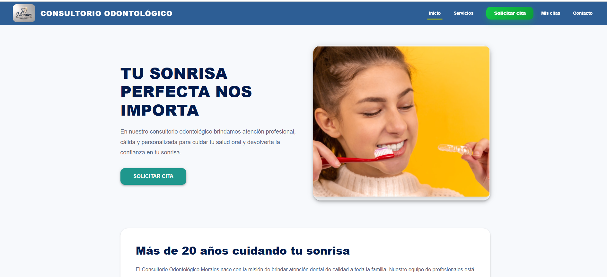

## Inicio de sesión
 

## Dashboard administrativo


## Gestión de Pacientes
Permite registrar, consultar, editar y eliminar pacientes.
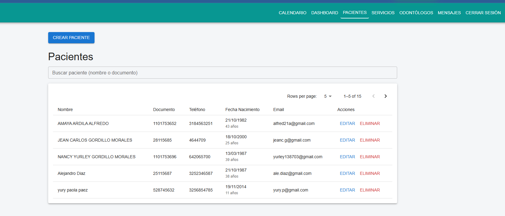

## Gestión de Servicios
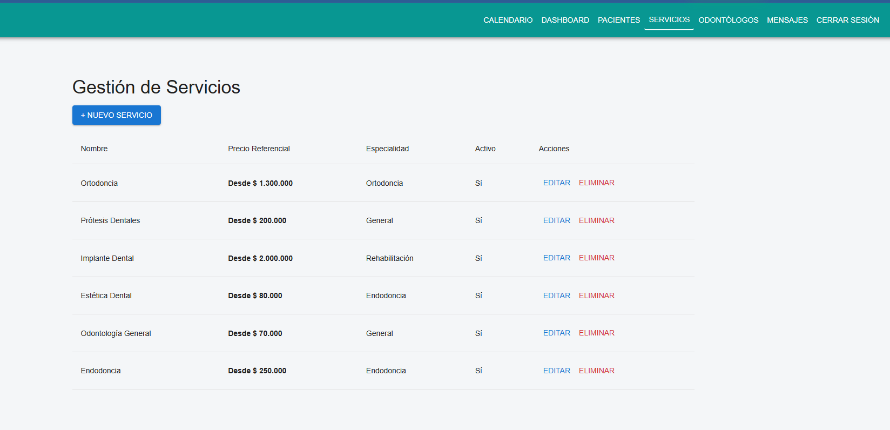

## Gestión de Citas
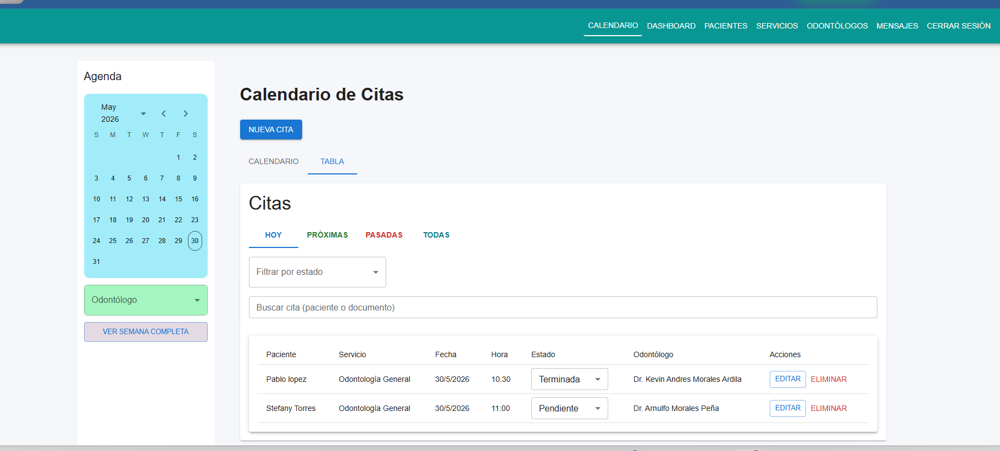

## Calendario de citas


## Reserva de Citas
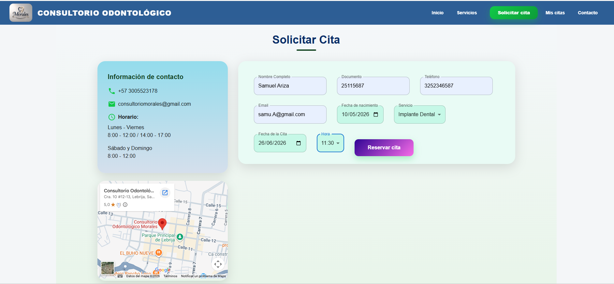

## Contacto


# Casos de prueba

## Evidencias de pruebas realizadas

### Login exitoso
Prueba de autenticación mediante JWT.
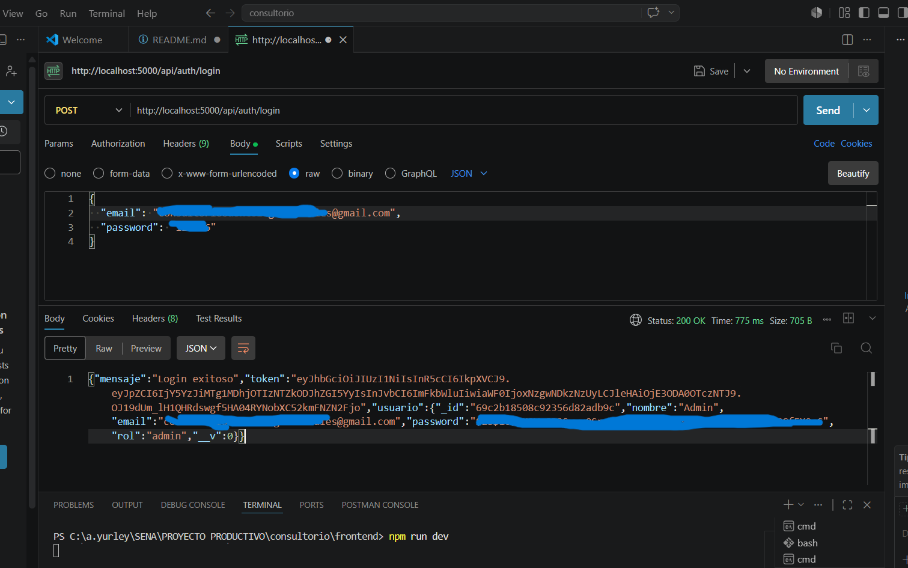

### Crear Administrador
Solo disponible para usuarios con rol administrador.
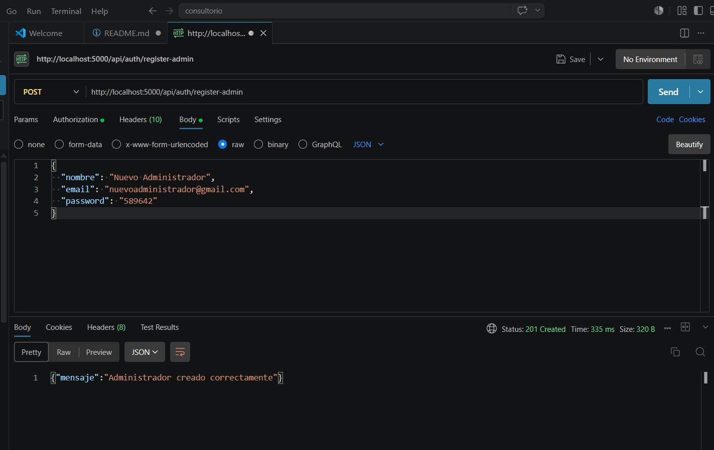

### Crear servicios
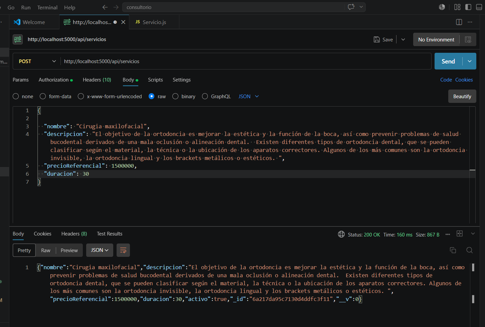

### Obtener Citas
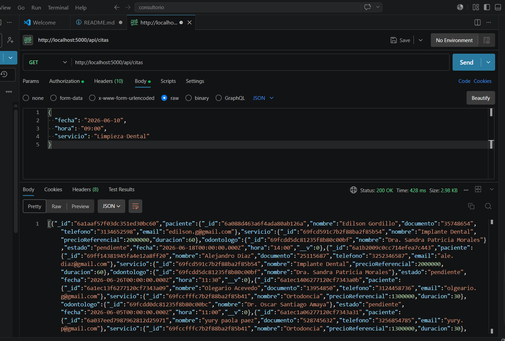

### Crear Paciente
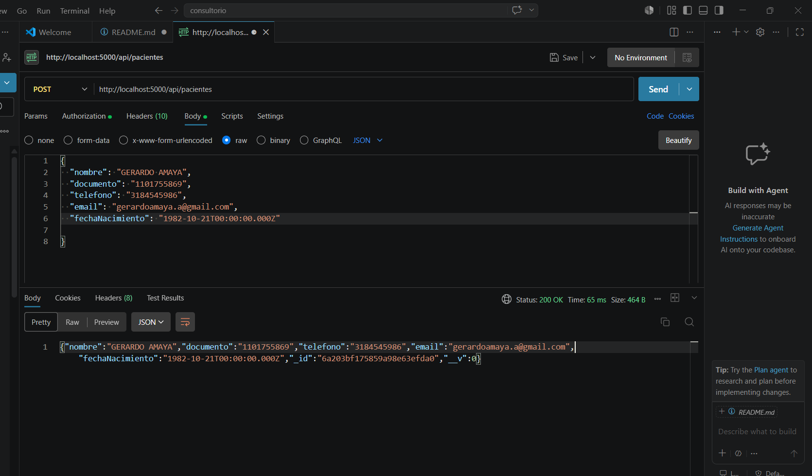

### Obtener Paciente
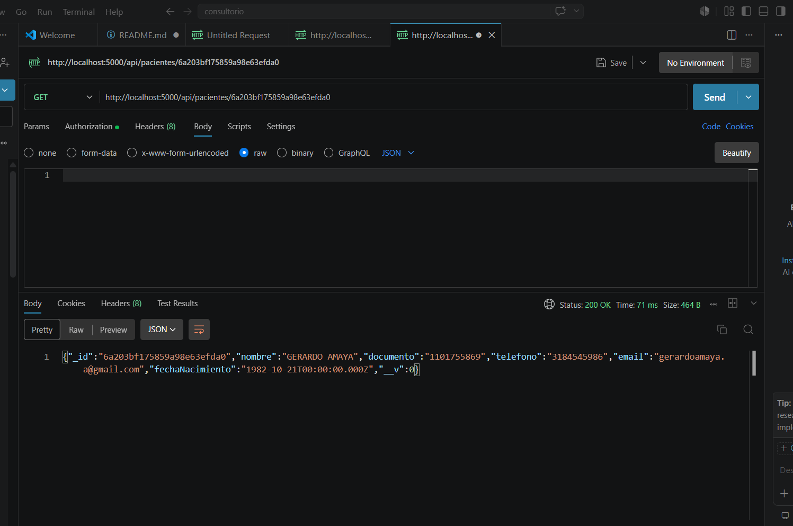

### Eliminar Paciente
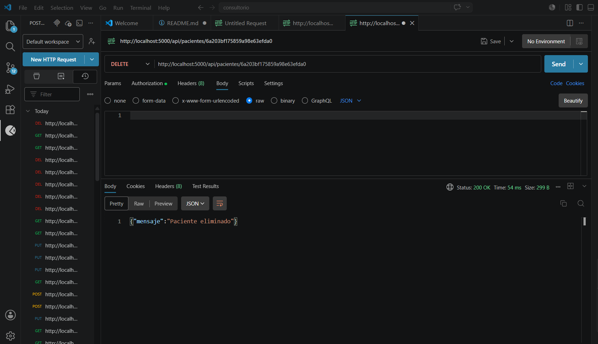

# Evidenacia test realizados

## Test
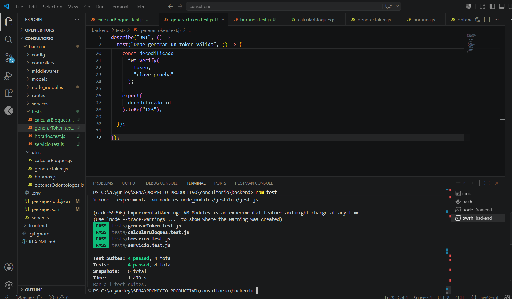

# Versión

Versión actual: 1.0.0

Última actualización: Junio 2026

# Estado del proyecto

Versión académica funcional.

Módulos implementados:
- Autenticación.
- Gestión de pacientes.
- Gestión de odontólogos.
- Gestión de servicios.
- Gestión de especialidades.
- Gestión de citas.
- Dashboard administrativo.
- Calendario de disponibilidad.

Pendientes:
- Mejoras visuales.
- Optimización de rendimiento.
- Nuevas funcionalidades futuras.

# Autor

Nancy Yurley Gordillo Morales

Proyecto desarrollado para el Servicio Nacional de Aprendizaje (SENA) como evidencia del proceso formativo en  Desarrollo y Programacion de Software.

# Licencia
Este proyecto está bajo la licencia MIT.
